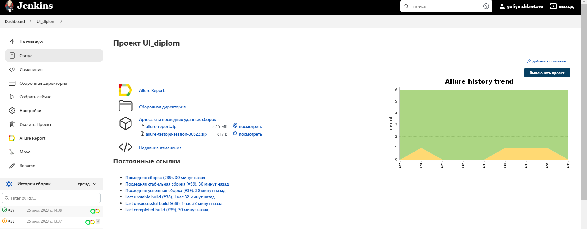

# **Project Name: UI testing**
This repository contains the code for US automated tests for https://demoqa.com/automation-practice-form. The project is part of a testing and automation course and aims to demonstrate the usage of recieved knowlege.

## **Technologies and Tools Used** 

- Programming Language: Python,  utilizing PageObject pattern
- Testing Framework: pytest
- Continuous Integration: Jenkins
- Reporting: Allure Test Report
- Test Management: Allure TestOps
- Issue Tracking: Jira
- Notification: Telegram

## **Continuous Integration with Jenkins**
The project is integrated with Jenkins for continuous integration. Jenkins is responsible for automatically building and testing the code with every push to the repository.

Jenkins Job URL:
_https://jenkins.autotests.cloud/job/UI_diplom/_

## **Allure Test Report**

The project uses Allure Test Report for generating comprehensive and interactive test reports. Allure Test Report provides detailed information about test execution, including test steps, attachments, and historical data.

Allure Test Report in Jenkins: 
_https://jenkins.autotests.cloud/job/UI_diplom/38/allure/_

  

## **Allure TestOps**

The project may be integrated with Allure TestOps for test management, storing test cases, and tracking test execution results.
Allure TestOps Project:
_https://allure.autotests.cloud/project/3536/dashboards_

      

## **Allure TestOps Project:**

Jira Integration
The project is integrated with Jira for issue tracking and project management. Jira allows for efficient tracking of bugs, tasks, and improvements related to the testing process.

Jira Task:
_https://jira.autotests.cloud/browse/HOMEWORK-817_

## **Notification in Telegram**

The project uses Telegram for receiving notifications about the test execution status.

Screenshot of Telegram Notification:

